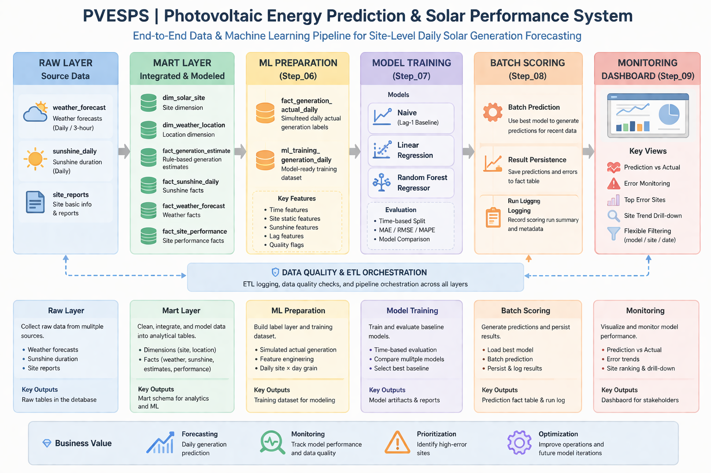

# PVESPS｜太陽光電發電預測與效能分析系統

> 一個以 **站點級每日發電量預測** 為核心的端到端資料與機器學習作品集專案。  
> 重點不只在模型訓練，而在於完整打通 **資料平台 → 訓練資料 → 模型評估 → 批次推論 → 預測監控**，展示機器學習如何落地成可被營運使用的資料產品流程。

---

## 專案亮點

- 建立 **太陽光電每日發電量預測** 的完整資料與 ML workflow
- 以 **site × day** 為粒度建置 training dataset
- 使用 **time-based split** 比較 baseline 模型
- 完成 **batch scoring 落庫**
- 建立 **prediction monitoring dashboard**
- 專案重點不只在模型，而在於 **資料 → 模型 → 推論 → 監控** 的完整串接

---

## 適合展示的職務方向

- Data Engineer
- Analytics Engineer
- Machine Learning Engineer（Junior / Entry Level）
- 資料平台 / 預測分析 / AI 應用相關職缺

---

## 架構總覽

下圖展示 PVESPS 從原始資料、mart 建模、ML preparation、模型訓練、批次推論到監控儀表板的完整流程：



---

## 商業問題

太陽能發電量高度受天氣與日照條件影響，但實務上資料常分散於不同來源，難以直接支援預測、監控與營運決策。

若只有原始資料或單次模型實驗，通常仍無法回答這些問題：

- 哪些站點目前預測誤差最大？
- 預測值與實際值隨時間如何變化？
- 模型是否開始失準？
- 哪些站點應優先安排巡檢或維運？

---

## 解決方案

本專案建立一套從原始資料擷取、資料建模、訓練資料建置、模型評估、批次推論到預測監控儀表板的完整流程，將太陽光電資料平台延伸成一個可支援預測與決策的資料產品。

PVESPS 的核心目標，是回答三個問題：

1. 如何把天氣與日照資料整理成模型可用的訓練資料？
2. 監督式學習模型能否優於簡單的 naive baseline？
3. 模型輸出如何被保存、監控，並轉成可支援決策的資訊？

---

## 專案定位

這不是單純的 Kaggle notebook 專案，也不是只展示單一模型分數的實驗。

PVESPS 更接近一個 **產品導向的 ML pipeline 作品集**，重點放在：

- 資料流程與 ETL 設計
- mart / feature layer 建置
- time-based model evaluation
- scoring result persistence
- prediction dashboard 與 monitoring 視角

---

## 這個專案展示的能力

### 資料工程
- ETL workflow 設計
- mart 導向 fact / dimension modeling
- 每日粒度 feature preparation
- data quality checks 與 run logging

### 機器學習
- label layer 建置
- training dataset engineering
- time-based model evaluation
- baseline model comparison

### ML Engineering
- batch scoring pipeline
- prediction persistence
- scoring log / run log 設計
- model artifact 與 metadata 串接

### 產品 / 決策層
- prediction vs actual 監控
- site-level error ranking
- 單站趨勢 drill-down
- dashboard-based result presentation

---

## High-level Data Flow

```text
Raw Layer
  ├─ weather_forecast
  ├─ sunshine_daily
  └─ site_reports

↓ ETL / cleansing / DQ

Mart Layer
  ├─ dim_solar_site
  ├─ dim_weather_location
  ├─ fact_generation_estimate
  ├─ fact_sunshine_daily
  ├─ fact_weather_forecast
  └─ fact_site_performance

↓ Step_06 ML preparation

ML Layer
  ├─ fact_generation_actual_daily
  └─ ml_training_generation_daily

↓ Step_07 model training

Model Layer
  ├─ naive lag-1 baseline
  ├─ linear regression
  └─ random forest

↓ Step_08 batch scoring

Prediction Layer
  ├─ fact_generation_prediction_daily
  └─ model_scoring_run_log

↓ Step_09 monitoring

Dashboard Layer
  └─ prediction dashboard
```

## 核心資料模型
### Mart / 營運分析層
 - mart.dim_solar_site
 - mart.dim_weather_location
 - mart.fact_generation_estimate
 - mart.fact_sunshine_daily
 - mart.fact_weather_forecast
 - mart.fact_site_performance

### ML 準備層
 - mart.fact_generation_actual_daily
 - mart.ml_training_generation_daily

### Prediction / Scoring 層
 - mart.fact_generation_prediction_daily
 - meta.model_scoring_run_log
 - meta.etl_run_log

## 專案步驟總覽
### Step_01 ~ Step_05｜資料平台基礎建置

前期階段主要完成：
 - 天氣與日照資料擷取
 - 維度表與事實表建置
 - rule-based 發電估算
 - 初步 dashboard 視覺化
 - 後續 ML 所需的 mart 結構準備

這一段的重點，是把資料平台的底打穩。

### Step_06｜訓練資料集建置
Step_06 是本專案從「資料分析導向」正式走向「機器學習導向」的關鍵階段。

### 主要產出
 - mart.fact_generation_actual_daily
 - mart.ml_training_generation_daily

### 已完成內容
 - 建立 simulated daily generation label layer
 - 串接 estimate / sunshine / site dimension
 - 建立 site × day 粒度的 model-ready training rows
 - 完成以下特徵工程：
   - 時間特徵
   - 站點靜態特徵
   - 日照特徵
   - lag 特徵
   - 品質旗標

### 特徵範例
 - month_num
 - weekday_num
 - season_code
 - install_area_ping
 - capacity_kw
 - panel_efficiency
 - sunshine_hours
 - estimated_generation_rule_kwh
 - lag_1_generation_kwh
 - lag_3_avg_generation_kwh
 - lag_7_avg_generation_kwh
 - lag_14_avg_generation_kwh


## Step_07｜Baseline 模型訓練
Step_07 用於驗證 training dataset 是否足以支撐有意義的每日發電量回歸模型。

### 訓練設定
 - Source table：mart.ml_training_generation_daily
 - Task：supervised regression
 - Target：target_generation_kwh
 - Split strategy：time-based split

### 資料切分
 - Train：260 rows
 - Validation：56 rows
 - Test：56 rows

### 比較模型
 - naive lag-1 baseline
 - linear regression
 - random forest regressor

### 評估指標
 - MAE
 - RMSE
 - MAPE

### Step_07 結果
```text
### 模型	Valid MAE	Valid RMSE	Valid MAPE	Test MAE	Test RMSE	Test MAPE
Random Forest	35.5778	66.0636	1.9315	109.1443	194.9187	4.8945
Linear Regression	44.3132	56.5661	3.4323	63.7382	84.5206	4.4156
Naive lag-1	138.1998	180.9771	8.7417	227.5230	323.7055	11.0914
```

### 結果重點
 - 兩個監督式模型都明顯優於 naive baseline
 - Random Forest 在 validation set 表現較佳
 - Linear Regression 在 test set 泛化較穩定
 - 因此目前將 Linear Regression 定位為第一版較適合部署的 baseline

## Step_08｜批次推論與預測結果落庫
Step_08 將模型從訓練階段延伸為可執行的推論流程。

### 主要產出
 - mart.fact_generation_prediction_daily
 - meta.model_scoring_run_log

### 已完成內容
 - 載入最佳模型 artifact
 - 自 mart.ml_training_generation_daily 擷取 scoring input
 - 執行 batch prediction
 - 於 historical backtest 模式下回填 actual 值
 - 計算 prediction error 欄位
 - 將預測結果落庫
 - 記錄 scoring run summary

### Scoring 結果
已成功執行一輪 historical backtest scoring：

 - run_id = 26
 - score_date_from = 2026-03-06
 - score_date_to = 2026-03-19
 - total_input_rows = 56
 - output_rows = 56
 - status = SUCCESS

這代表專案目前已具備：
 - 預測結果生成
 - 預測結果落庫
 - actual vs predicted 對照
 - 誤差監控基礎

## Step_09｜Prediction Dashboard
Step_09 建立了監控導向的 dashboard，用來展示模型輸出、誤差模式與站點層級觀察結果。

### Dashboard 重點
 - predicted vs actual 比較
 - 每日誤差監控
 - 站點級誤差排行
 - 單站趨勢下鑽
 - 多條件篩選：
   - model
   - model version
   - prediction type
   - site
   - date range

### Dashboard 價值
這一步讓模型輸出不再只是離線實驗結果，而是轉化為可被營運端與管理端閱讀的資訊。

可回答的問題包括：

 - 哪些站點目前預測誤差最大？
 - 預測發電量與實際發電量如何隨時間變化？
 - 目前看到的是哪個模型版本？
 - 哪些站點值得優先檢查？

## 目前專案價值
### 資料工程
 - ETL workflow 設計
 - mart 導向的 fact / dimension modeling
 - 每日粒度 feature preparation
 - run logging 與 scoring logging

### 機器學習
 - label layer 建置
 - training dataset engineering
 - time-based model evaluation
 - baseline model comparison
batch scoring pipeline

### 產品 / 決策層
 - prediction fact table 落庫
 - actual vs predicted 監控
 - site-level error ranking
 - dashboard-based result presentation

## 商業意義

從商業角度來看，PVESPS 展示了一個太陽光電資料平台如何從描述性分析，進一步延伸為預測式決策支援。

### 可延伸應用情境
 - 短期每日發電量預測
 - 找出預測表現不穩定的站點
 - 排定優先維運 / 巡檢候選站點
 - 比較預期發電量與實際發電量落差

這表示本專案不只是追求模型分數，而是在示範如何將資料轉換成營運可見度與決策輔助資訊。

## 專案限制
 - 目前 target label 仍為 simulated generation，尚未導入真實 inverter output
 - 部分天氣特徵 coverage 仍不足
 - 現階段資料量仍偏小，複雜模型較易過擬合


## 後續優化方向
### 資料面
 - 以真實發電量取代 simulated labels
 - 將 weather forecast 聚合成每日 ML features
 - 補強 radiation coverage
 - 引入更多營運訊號（維護 / 故障 / 清潔度）

### 模型面
 - 根據實際 coverage 進行 feature pruning
 - 模型超參數調校
 - 版本化模型比較
 - interval prediction 優化

### 產品面
 - 實作 day-ahead scoring mode
 - dashboard 比較不同模型版本
 - 加入站點告警邏輯
 - 延伸 maintenance recommendation layer

### 專案結構
```text
PVESPS_光電產業專案/
├─ Step_05_白天降雨風險視覺化/
├─ Step_06_建立ML訓練資料集/
│  ├─ build_actual_generation_daily.py
│  ├─ build_training_dataset.py
│  └─ schema_postgres_step06.sql
├─ Step_07_訓練基準模型與樹模型/
│  ├─ train_baseline_model.py
│  └─ artifacts/
│     ├─ models/
│     ├─ predictions/
│     └─ reports/
├─ Step_08_批次推論與結果落庫/
│  ├─ score_generation_prediction.py
│  └─ schema_postgres_step08.sql
├─ Step_09_Prediction_Dashboard與模型監控/
│  ├─ app_prediction_dashboard.py
│  └─ app_prediction_dashboard_v1_1.py
├─ README.md
└─ README_CHT.md
```

## 執行方式

### Step_06｜建立 ML label 與 training dataset
```bash
python Step_06_建立ML訓練資料集\build_actual_generation_daily.py
python Step_06_建立ML訓練資料集\build_training_dataset.py
```

### Step_07｜訓練 baseline 模型
```bash
python Step_07_訓練基準模型與樹模型\train_baseline_model.py
```

### Step_08｜執行 batch scoring
```bash
python Step_08_批次推論與結果落庫\score_generation_prediction.py
```

### Step_09｜啟動 prediction dashboard
```bash
python -m streamlit run ".\Step_09_Prediction_Dashboard與模型監控\app_prediction_dashboard_v1_1.py"
```

## 最終總結

PVESPS 是一個展示太陽光電資料平台如何延伸成實務型 ML workflow 的作品集專案。

它目前已包含：

 - 結構化 mart 設計
 - odel-ready training data construction
 - baseline model evaluation
 - batch scoring 與 prediction persistence
 - prediction monitoring dashboard

這個專案展示的，不只是如何訓練模型，而是如何把機器學習嵌入一條可落地的資料產品流程中。
